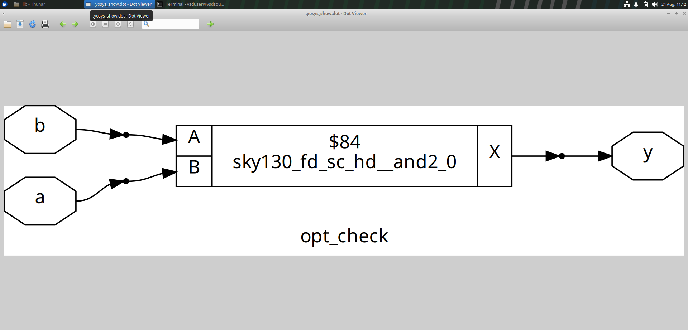
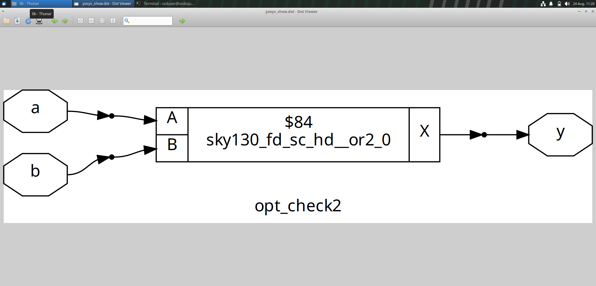
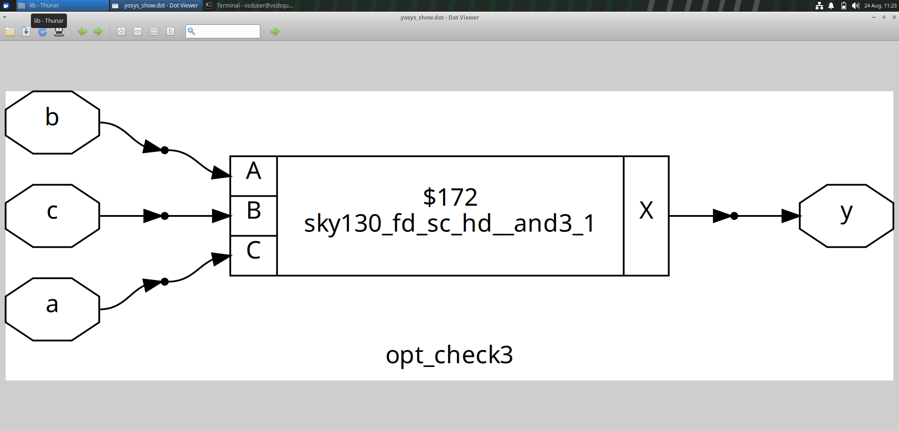
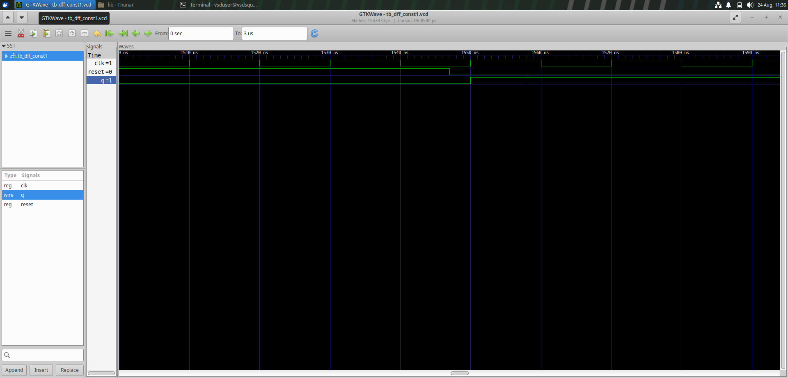
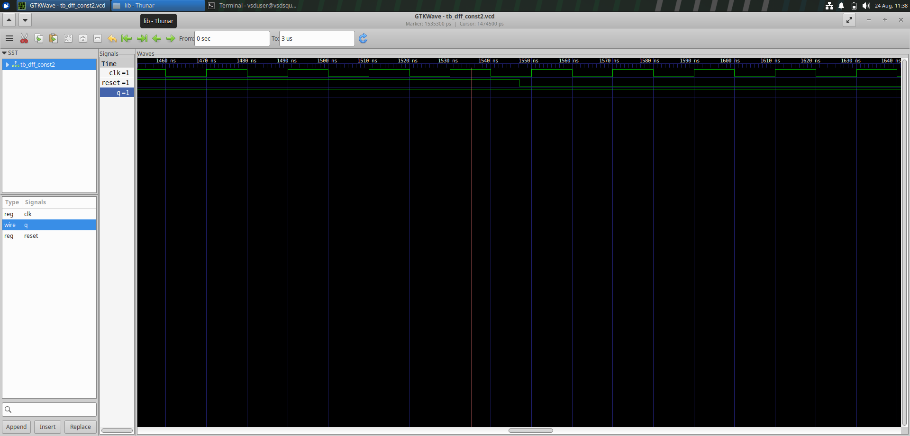
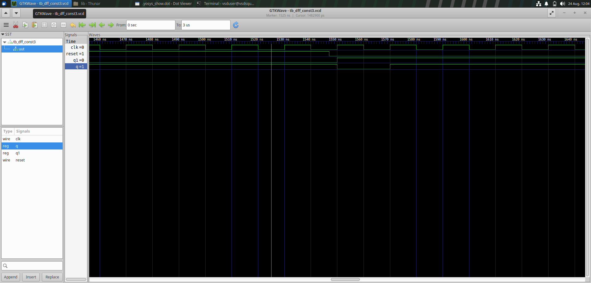
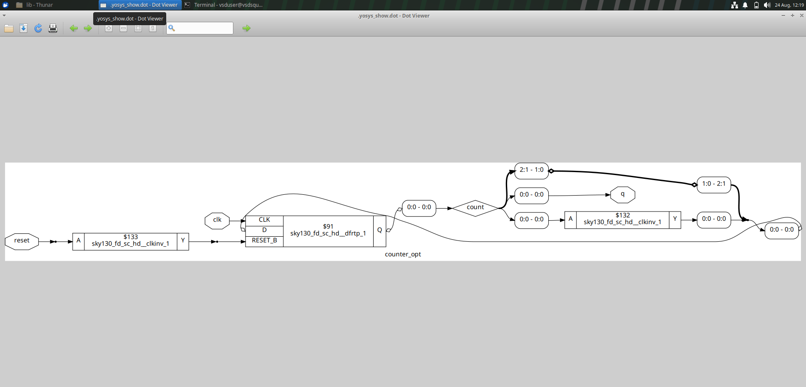

🧠 Day 3 — RTL Optimization & Synthesis

«RTL Design Workshop | Day 3»

---

📌 Overview

Day 3 focuses on understanding how RTL descriptions are optimized during synthesis and how different coding approaches can influence the resulting hardware implementation.

The session covers combinational logic optimization, constant propagation, D Flip-Flop optimization, and counter optimization.

---

🎯 Objectives

- 🔹 Understand the concept of RTL optimization.
- 🔹 Study Boolean and combinational logic optimization.
- 🔹 Understand constant propagation.
- 🔹 Analyze optimization of sequential circuits.
- 🔹 Study D Flip-Flop optimization.
- 🔹 Understand counter optimization.
- 🔹 Observe how RTL is converted into synthesized hardware.

---

📚 Topics Covered

🔢| Topic
1️⃣| RTL Optimization
2️⃣| Combinational Logic Optimization
3️⃣| Constant Propagation
4️⃣| D Flip-Flop Optimization
5️⃣| Counter Optimization

---

1️⃣ RTL Optimization

RTL (Register Transfer Level) describes how data moves between registers and how operations are performed on that data.

During synthesis, the RTL description is analyzed and converted into a hardware implementation. The synthesis tool can simplify the design by removing redundant logic, propagating constant values, and restructuring logic while maintaining the required functionality.

🔧 Common Optimization Techniques

- Boolean simplification
- Constant propagation
- Removal of redundant logic
- Elimination of unused logic
- Logic restructuring
- Technology mapping

💡 Why RTL Optimization?

Parameter| Purpose
📐 Area| Reduce unnecessary hardware
⚡ Power| Reduce unnecessary switching
🚀 Timing| Improve circuit performance
🧩 Complexity| Simplify the final implementation

---

2️⃣ Combinational Logic Optimization

Combinational logic produces an output based only on the present input values.

During synthesis, Boolean expressions can be analyzed and simplified using standard Boolean identities.

🧮 Useful Boolean Identities

Expression| Simplified Result
"A · 1"| "A"
"A · 0"| "0"
"A + 0"| "A"
"A + 1"| "1"
"A · A"| "A"
"A + A"| "A"

These simplifications help reduce unnecessary hardware in the synthesized design.

---

2.1 🔹 AND Logic

An AND gate produces a HIGH output only when all of its inputs are HIGH.

Boolean Expression

Y = A · B

Truth Table

A| B| Y
0| 0| 0
0| 1| 0
1| 0| 0
1| 1| 1

🔍 Synthesized Result

The RTL description is mapped to an equivalent hardware implementation during synthesis.

«💡 Observation: The synthesized result represents the hardware implementation of the AND operation.»

---

2.2 🔹 OR Logic

An OR gate produces a HIGH output when at least one of its inputs is HIGH.

Boolean Expression

Y = A + B

Truth Table

A| B| Y
0| 0| 0
0| 1| 1
1| 0| 1
1| 1| 1

🔍 Synthesized Result

«💡 Observation: The synthesized result shows the hardware implementation corresponding to the OR operation.»

---

2.3 🔹 Three-Input AND

A three-input AND gate produces HIGH only when all three inputs are HIGH.

Boolean Expression

Y = A · B · C

Truth Table

A| B| C| Y
0| 0| 0| 0
0| 0| 1| 0
0| 1| 0| 0
0| 1| 1| 0
1| 0| 0| 0
1| 0| 1| 0
1| 1| 0| 0
1| 1| 1| 1

🔍 Synthesized Result

«💡 Observation: The synthesized implementation maintains the expected three-input AND functionality.»

---

3️⃣ 🔄 Constant Propagation

Constant propagation is an optimization technique in which known constant values are used to simplify a circuit.

For example:

A · 0 = 0
A · 1 = A

A + 0 = A
A + 1 = 1

If the synthesis tool determines that a signal always has a fixed value, the dependent logic can be simplified or removed.

✨ Benefits of Constant Propagation

Benefit| Description
🧹 Logic Reduction| Removes unnecessary logic
📐 Area Reduction| Can reduce hardware resources
⚡ Lower Switching| Avoids unnecessary transitions
🚀 Better Efficiency| Produces a simpler implementation

Constant propagation can be applied to both combinational and sequential circuits.

---

4️⃣ 💾 D Flip-Flop Optimization

A D Flip-Flop (DFF) is a sequential storage element commonly used in synchronous digital systems.

For a positive-edge-triggered D Flip-Flop:

Q(next) = D

The value present at the "D" input is transferred to the output "Q" at the active clock edge.

When the synthesis tool identifies constant information at the input of a sequential element, it can use that information to optimize the resulting hardware.

---

4.1 🔹 DFF with Constant 1

This experiment demonstrates the synthesized implementation and simulation behavior of a D Flip-Flop associated with a constant value.

🔧 Synthesized Circuit

📈 Simulation Waveform

📈 Netlist
.png)

«💡 Observation: The synthesized circuit and waveform demonstrate the behavior of the D Flip-Flop under the given constant condition.»

---

4.2 🔹 DFF with Constant 2

This experiment continues the study of constant propagation in sequential logic.

🔧 Synthesized Circuit

📈 Simulation Waveform

📈 Netlist
.png)

«💡 Observation: The waveform verifies the sequential behavior, while the synthesized diagram shows the corresponding hardware implementation.»

---

4.3 🔹 DFF with Constant 3

The third experiment further demonstrates the effect of constant information on sequential logic.

🔧 Synthesized Circuit

📈 Simulation Waveform

📈 Netlist
.png)

«💡 Observation: Comparing the synthesized circuit and simulation helps relate RTL behavior to the resulting hardware.»

---

5️⃣ 🔢 Counter Optimization

A counter is a sequential circuit that progresses through a predefined sequence of states.

For an "N-bit" binary counter, the number of possible states is:

2^N

For example, a 3-bit counter follows the sequence:

000 → 001 → 010 → 011
     ↓
100 → 101 → 110 → 111
     ↓
000

A counter contains both storage elements and combinational next-state logic, making it useful for studying sequential optimization.

---

🔵 Original Counter

The original counter implementation is shown below.

«💡 Observation: The image represents the synthesized implementation of the original counter design.»

---

🟢 Modified Counter

After modifying the RTL implementation, the resulting synthesized structure can be compared with the original desig.
.png)

---

6️⃣ 💡 Key Learnings

🔢| Learning
1️⃣| RTL descriptions can be optimized during synthesis.
2️⃣| Boolean expressions can be simplified using standard logic identities.
3️⃣| Constant propagation can eliminate unnecessary logic.
4️⃣| Sequential circuits can also undergo synthesis optimization.
5️⃣| D Flip-Flops are important building blocks of synchronous systems.
6️⃣| Counters contain both sequential and combinational logic.
7️⃣| The synthesized hardware structure may differ from the original RTL description.
8️⃣| RTL coding decisions can influence the final hardware implementation.

---

7️⃣ 🏁 Conclusion

Day 3 provided practical exposure to RTL optimization and synthesis techniques.

The experiments demonstrated how basic combinational logic can be optimized, how constant values can simplify circuits, and how sequential elements such as D Flip-Flops and counters are represented during synthesis.

The overall design flow can be summarized as:

📝 RTL Description
       ↓
🔍 RTL Analysis
       ↓
⚙️ Optimization
       ↓
🔨 Synthesis
       ↓
🧩 Hardware Implementation
       ↓
📊 Verification

⭐ Final Takeaway

«The way a circuit is described in RTL can influence the structure and efficiency of the synthesized hardware.»

---

📊 Day 3 Summary

🧪 Area| 📌 Concepts
⚡ Combinational Logic| AND, OR, Three-Input AND
🔄 Optimization| Boolean simplification
📍 Constant Propagation| Logic reduction
💾 Sequential Logic| D Flip-Flop optimization
🔢 Counters| Sequential circuit optimization
🔨 Synthesis| RTL → Hardware
📈 Verification| Simulation waveforms

---

