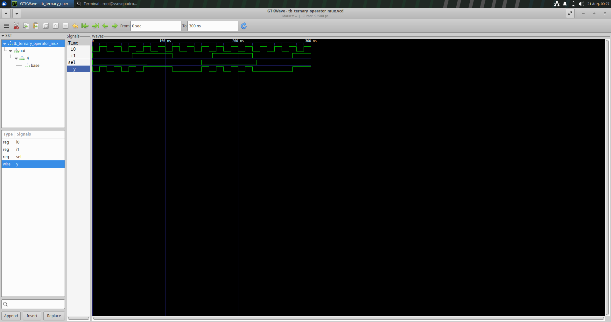
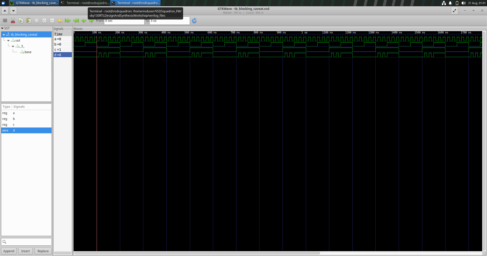

🧪 Day 4 — RTL Design, Synthesis & Gate-Level Simulation

«VSD RTL Design Workshop | Day 4»

Day 4 focused on understanding the journey from RTL description to synthesized hardware and finally to Gate-Level Simulation (GLS).

The experiments helped me understand MUX implementation, sensitivity lists, blocking assignments, synthesis using Yosys, standard-cell mapping and the importance of checking RTL behaviour against the synthesized design.

---

📌 Topics Covered

#| Topic| Status
1️⃣| Ternary Operator based MUX| ✅ Completed
2️⃣| RTL Simulation| ✅ Completed
3️⃣| Yosys Synthesis| ✅ Completed
4️⃣| Standard Cell Mapping| ✅ Completed
5️⃣| Gate-Level Simulation| ✅ Completed
6️⃣| Incomplete Sensitivity List| ✅ Completed
7️⃣| Blocking Assignment| ✅ Completed
8️⃣| RTL vs GLS Comparison| ✅ Completed

---

🔄 1. RTL → Synthesis → GLS Flow

The Day 4 experiments followed this overall flow:

        RTL Verilog
             ↓
       RTL Simulation
             ↓
        Yosys Synthesis
             ↓
      Technology Mapping
             ↓
      Gate-Level Netlist
             ↓
    Gate-Level Simulation
             ↓
         GTKWave
             ↓
      Waveform Analysis

🧠 In simple words

The RTL code describes what the circuit should do.

Synthesis converts that RTL into a hardware structure using standard cells.

The generated gate-level netlist is then simulated again to verify the synthesized implementation.

---

🔀 2. Ternary Operator MUX

📖 What is a MUX?

A multiplexer selects one input from multiple inputs and sends the selected input to the output.

For a 2:1 MUX:

"sel"| Output
"0"| "y = i0"
"1"| "y = i1"

The MUX can be described using the Verilog ternary operator:

assign y = sel ? i1 : i0;

This is a compact way of describing conditional selection logic.

---

🖥️ RTL Simulation

The MUX was first verified using RTL simulation.

The main signals observed were:

- "i0"
- "i1"
- "sel"
- "y"

When "sel = 0", the output follows "i0".

When "sel = 1", the output follows "i1".

📸 RTL Waveform

"Ternary MUX RTL Simulation" 

«✅ Observation: The RTL waveform confirms the expected functional behaviour of the 2:1 MUX.»

---

⚙️ Synthesis

The RTL design was synthesized using Yosys.

During synthesis, the RTL description is converted into a hardware implementation using cells from the SKY130 standard-cell library.

The MUX was mapped to:

sky130_fd_sc_hd__mux2_1

📸 Synthesized Netlist

"Ternary MUX Synthesized Netlist" 

«🔍 Observation: The netlist shows how the simple RTL MUX description is represented using a standard-cell based implementation.»

---

🔬 Gate-Level Simulation

The synthesized netlist was then used for Gate-Level Simulation.

The testbench was used to apply different input combinations and the resulting waveform was observed using GTKWave.

📸 GLS Waveform

"Ternary MUX Gate-Level Simulation" 

«✅ Observation: The GLS waveform can be compared with the RTL waveform to verify that the synthesized MUX preserves the intended functionality.»

---

🔁 Ternary MUX Flow

RTL MUX
   ↓
Ternary Operator
   ↓
Yosys Synthesis
   ↓
sky130_fd_sc_hd__mux2_1
   ↓
Gate-Level Netlist
   ↓
Gate-Level Simulation

---

⚠️ 3. Bad MUX — Incomplete Sensitivity List

🚨 The Problem

A MUX can also be described using an "always" block.

An incorrect implementation can be written as:

always @(sel)
begin
    if (sel)
        y = i1;
    else
        y = i0;
end

The problem is that only "sel" is present in the sensitivity list.

However, the output depends on:

sel
i0
i1

If "i0" or "i1" changes while "sel" remains unchanged, the "always" block may not execute.

This can result in incorrect RTL simulation behaviour.

---

🖥️ Bad MUX — RTL Simulation

📸 RTL Waveform

"Bad MUX RTL Simulation" 

«⚠️ Observation: Changes in the data inputs may not immediately update the output when "sel" remains unchanged.»

This happens because the RTL simulator only triggers the procedural block when a signal in its sensitivity list changes.

---

🔬 Bad MUX — Gate-Level Simulation

The sensitivity list is mainly a simulation construct.

During synthesis, the synthesizer analyses the logic inside the procedural block and generates the corresponding hardware.

Therefore, an incomplete sensitivity list can result in a difference between:

RTL Simulation

and

Synthesized Hardware Behaviour

📸 Gate-Level Waveform

"Bad MUX Gate-Level Simulation" 

«🔍 Key Observation: The comparison demonstrates how careless RTL coding can result in a simulation-synthesis mismatch.»

---

✅ 4. Correct Coding Style

For combinational logic, the preferred form is:

always @(*)
begin
    if (sel)
        y = i1;
    else
        y = i0;
end

The "@(*)" construct automatically includes the signals referenced inside the block in the sensitivity list.

❌ Avoid

always @(sel)

✅ Prefer

always @(*)

This reduces the possibility of accidentally missing input signals from the sensitivity list.

---

⛓️ 5. Blocking Assignment Caveat

Verilog provides two important procedural assignment operators:

Assignment| Operator| Common Usage
Blocking| "="| Combinational logic
Non-Blocking| "<="| Sequential logic

A blocking assignment executes immediately within the procedural flow.

Example:

always @(*)
begin
    x = a | b;
    d = x & c;
end

Here:

1. "x = a | b" executes first.
2. The value of "x" is updated immediately.
3. The next statement uses the updated value of "x".

Therefore, statement ordering matters when using blocking assignments.

---

🖥️ Blocking Assignment — RTL Simulation

📸 RTL Waveform

"Blocking Assignment RTL Simulation" 

«💡 Observation: The waveform shows the behaviour of the intermediate signal and final output during RTL simulation.»

---

⚙️ Synthesized Netlist

The design was synthesized using Yosys and mapped to SKY130 standard cells.

One of the relevant cells is:

sky130_fd_sc_hd__o21a_1

📸 Synthesized Netlist

"Blocking Assignment Synthesized Netlist"

«🔍 Observation: The synthesized netlist represents the actual combinational hardware generated from the RTL description.»

---

🔬 Blocking Assignment — Gate-Level Simulation

The synthesized netlist was simulated at the gate level.

📸 GLS Waveform

"Blocking Assignment Gate-Level Simulation"

«🔎 Observation: Comparing RTL and GLS helps connect the procedural RTL description with the synthesized hardware implementation.»

---

⚖️ 6. Blocking vs Non-Blocking Assignment

Feature| Blocking "="| Non-Blocking "<="
Execution| Immediate| Scheduled
Statement order| Important| Updates occur after evaluation
Typical use| Combinational logic| Sequential logic
Common block| "always @(*)"| "always @(posedge clk)"
Example| "x = a & b;"| "q <= d;"

🔹 Blocking Assignment

always @(*)
begin
    x = a | b;
    d = x & c;
end

The statements execute sequentially.

🔹 Non-Blocking Assignment

always @(posedge clk)
begin
    q <= d;
end

Non-blocking assignments are commonly used to model registers and flip-flops.

---

🧩 7. Why "always @(*)" Matters

For combinational logic, every input that can affect the output must be considered.

An incomplete sensitivity list such as:

always @(sel)

can cause incorrect RTL simulation.

Using:

always @(*)

allows changes in the signals used inside the block to trigger the procedural block.

⭐ Key Point

«For combinational procedural logic, "always @(*)" helps avoid missing signals in the sensitivity list.»

---

🔍 8. RTL Simulation vs Gate-Level Simulation

Parameter| RTL Simulation| Gate-Level Simulation
Design| RTL Verilog| Synthesized Netlist
Stage| Before synthesis| After synthesis
Main purpose| Functional verification| Post-synthesis verification
Representation| RTL description| Standard-cell implementation
Synthesis| Not required| Required
Simulator| Icarus Verilog| Icarus Verilog
Waveform Viewer| GTKWave| GTKWave

🖥️ RTL Simulation

Checks whether the Verilog RTL behaves as intended.

⚙️ Gate-Level Simulation

Checks the behaviour of the synthesized implementation.

Comparing both provides additional confidence that the synthesized hardware represents the intended RTL functionality.

---

🚨 9. Simulation-Synthesis Mismatch

A simulation-synthesis mismatch occurs when the behaviour observed during RTL simulation differs from the behaviour of the synthesized hardware.

One major cause studied today:

always @(sel)

The RTL simulator reacts only to changes in "sel".

However, the output also depends on "i0" and "i1".

Better approach:

always @(*)

This experiment highlighted an important lesson:

«⚠️ RTL should be written carefully so that both simulation behaviour and synthesized hardware represent the intended design.»

---

🛠️ 10. Tools Used

🧰 Tool| 🎯 Purpose
Icarus Verilog| Verilog compilation and simulation
GTKWave| Waveform viewing and analysis
Yosys| RTL synthesis and netlist generation
SKY130 PDK| Standard-cell library for technology mapping

---

📌 11. Key Takeaways

🔀 Ternary MUX

assign y = sel ? i1 : i0;

A simple and compact way to describe a 2:1 multiplexer.

⚠️ Incomplete Sensitivity List

always @(sel)

Can cause incorrect RTL simulation when other input signals change.

✅ Recommended Combinational Style

always @(*)

Automatically considers signals referenced inside the block.

⛓️ Blocking Assignment

=

Executes immediately and sequentially within the procedural block.

🔬 Gate-Level Simulation

Provides post-synthesis verification by simulating the synthesized netlist.

---

🧠 12. Learning Outcomes

After completing Day 4, I gained an understanding of:

- ✅ RTL-to-Gate-Level flow
- ✅ Ternary operator based MUX design
- ✅ RTL simulation
- ✅ Yosys synthesis
- ✅ Standard-cell mapping
- ✅ SKY130 library cells
- ✅ Gate-level netlist generation
- ✅ Gate-Level Simulation
- ✅ GTKWave waveform analysis
- ✅ Verilog sensitivity lists
- ✅ Importance of "always @(*)"
- ✅ Blocking assignments
- ✅ Non-blocking assignments
- ✅ Simulation-synthesis mismatch
- ✅ RTL vs GLS comparison
- ✅ Better combinational RTL coding practices

---

🌟 13. Overall Learning

Day 4 helped me connect the different stages of the digital design process:

        💻 RTL CODE
             ↓
       🧪 SIMULATION
             ↓
        ⚙️ SYNTHESIS
             ↓
       🧩 STANDARD CELLS
             ↓
        📄 NETLIST
             ↓
        🔬 GLS
             ↓
       📊 WAVEFORM

The experiments demonstrated that writing RTL is not only about describing the required logic. The code must also be written carefully so that its simulation behaviour matches the intended hardware implementation.

---

🏁 Conclusion

Day 4 provided practical exposure to the complete flow from RTL design to synthesized hardware and Gate-Level Simulation.

The ternary MUX experiment showed how a simple RTL description can be transformed into a standard-cell implementation.

The Bad MUX experiment demonstrated the importance of a complete sensitivity list and showed how incorrect RTL coding can produce simulation-synthesis mismatches.

The blocking assignment experiment helped me understand how procedural statement ordering affects RTL simulation.

Overall, Day 4 strengthened my understanding of Verilog coding practices, synthesis, standard-cell mapping, netlist generation and post-synthesis verification.

---

📊 Day 4 Progress

Milestone| Status
📖 RTL concepts| ✅
🔀 Ternary MUX| ✅
🖥️ RTL Simulation| ✅
⚙️ Yosys Synthesis| ✅
🧩 Standard Cell Mapping| ✅
📄 Netlist Generation| ✅
🔬 Gate-Level Simulation| ✅
⚠️ Bad MUX Analysis| ✅
⛓️ Blocking Assignment| ✅
📊 Waveform Analysis| ✅
📝 README Documentation| ✅

---

🚀 Day 4 Complete!

«From RTL → Synthesis → Netlist → Gate-Level Simulation → Verification 🔥»

---
