🧩 Day 5 — Conditional RTL, CASE Statements & Looping Constructs

«VSD RTL Design Workshop | Day 5»

Day 5 focused on writing clear, complete and synthesis-friendly RTL using conditional statements and looping constructs in Verilog.

The experiments covered "if-else", "case", incomplete assignments, latch inference, "casez", synthesis optimization, procedural loops and generate loops.

Practical designs such as MUX, DEMUX and Ripple Carry Adder (RCA) were also explored to understand how these RTL constructs translate into hardware.

---

🎯 Day 5 at a Glance

🔹 Topic| 📌 Focus
"if-else"| Priority-based conditional logic
"case"| Multi-way selection
Incomplete "if"| Latch inference
Incomplete "case"| Missing assignment paths
Partial assignment| Storage inference
"casez"| Wildcard matching
Synthesis| Logic optimization
Procedural "for"| Repetitive RTL operations
Generate "for"| Repeated hardware structures
MUX| Data selection
DEMUX| Data routing
RCA| Multi-bit addition

---

📚 Contents

1. "Learning Objectives" (#-learning-objectives)
2. "Conditional RTL Coding" (#-conditional-rtl-coding)
3. "IF-ELSE and Priority Logic" (#-if-else-and-priority-logic)
4. "Latch Inference" (#-latch-inference)
5. "Incomplete IF" (#-experiment-1--incomplete-if)
6. "Incomplete IF-ELSE" (#-experiment-2--incomplete-if-else)
7. "CASE Statements" (#-case-statements)
8. "Incomplete CASE" (#-experiment-3--incomplete-case)
9. "Complete CASE" (#-experiment-4--complete-case)
10. "Partial CASE Assignment" (#-experiment-5--partial-case-assignment)
11. "CASEZ and Overlapping Conditions" (#-experiment-6--casez-and-overlapping-conditions)
12. "Synthesis Optimization" (#-synthesis-optimization)
13. "Looping Constructs" (#-looping-constructs-in-verilog)
14. "MUX Using FOR Loop" (#-experiment-7--mux-using-for-loop)
15. "DEMUX Using FOR Loop" (#-experiment-8--demux-using-for-loop)
16. "Ripple Carry Adder" (#-experiment-9--ripple-carry-adder)
17. "Procedural FOR vs Generate FOR" (#-procedural-for-vs-generate-for)
18. "Key Takeaways" (#-key-takeaways)
19. "Learning Outcomes" (#-learning-outcomes)
20. "Conclusion" (#-conclusion)

---

🎯 Learning Objectives

The main objectives of Day 5 were to understand:

- 🔹 Conditional RTL coding using "if-else"
- 🔹 Multi-way selection using "case"
- 🔹 Latch inference caused by incomplete assignments
- 🔹 Importance of complete combinational logic
- 🔹 Partial assignments inside "case"
- 🔹 Wildcard matching using "casez"
- 🔹 Problems caused by overlapping conditions
- 🔹 Logic optimization during synthesis
- 🔹 Procedural "for" loops
- 🔹 Generate "for" loops
- 🔹 MUX and DEMUX implementation
- 🔹 Ripple Carry Adder construction
- 🔹 Writing clean and synthesis-friendly RTL

---

🔀 Conditional RTL Coding

Conditional statements are widely used in RTL to describe circuits whose outputs depend on control signals.

Two important constructs are:

IF-ELSE
   ↓
Priority-based decisions

CASE
   ↓
Multi-way selection

The way these statements are written directly affects the hardware inferred during synthesis.

---

⚡ IF-ELSE and Priority Logic

An "if-else" statement checks conditions in sequence.

Example:

always @(*)
begin
    if (condition_1)
        y = value_1;
    else if (condition_2)
        y = value_2;
    else
        y = value_3;
end

The first true condition gets priority.

Condition| Priority
"if"| 🥇 Highest
"else if"| 🥈 Next
"else"| 🥉 Remaining

This makes "if-else" useful for designing priority-based logic.

---

🔒 Latch Inference

A latch can be unintentionally inferred when a combinational block does not assign an output for every possible condition.

For example:

always @(*)
begin
    if (enable)
        y = data;
end

When "enable = 0", there is no assignment to "y".

The hardware therefore needs to retain the previous value.

Incomplete RTL
      ↓
Missing assignment
      ↓
Previous value must be retained
      ↓
Latch inference ⚠️

✅ Better Coding Style

always @(*)
begin
    if (enable)
        y = data;
    else
        y = 1'b0;
end

Giving the output a value in every path avoids unintended latch inference.

---

🧪 Experiment 1 — Incomplete IF

An incomplete "if" statement was studied to understand how missing assignments can result in inferred storage.

Example:

always @(*)
begin
    if (i0)
        y = i1;
end

"i0"| Output
"1"| "y = i1"
"0"| No assignment ⚠️

📈 Simulation Waveform

"Incomplete IF Simulation"

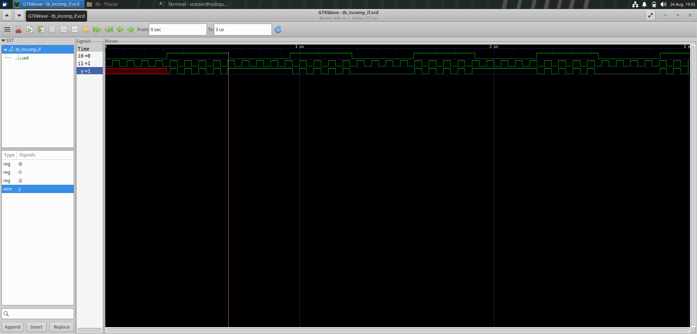

📊 Synthesized Netlist

"Incomplete IF Netlist"
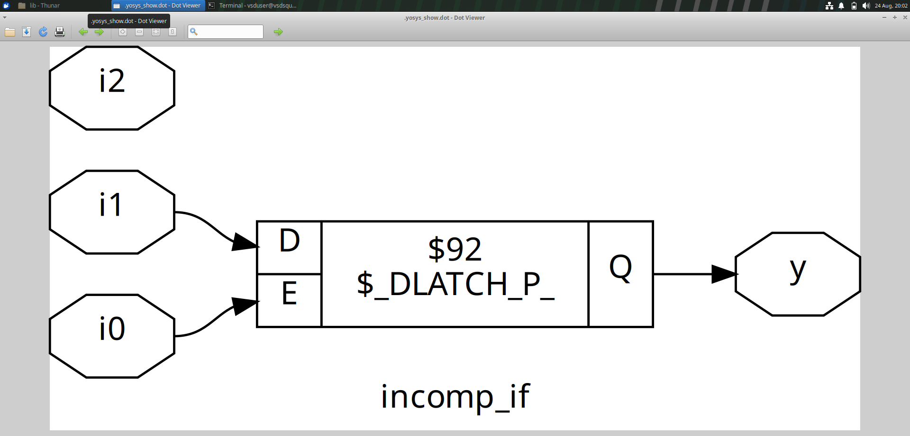

«⚠️ Observation: The incomplete conditional assignment can cause the output to retain its previous value, resulting in latch inference.»

---

🧪 Experiment 2 — Incomplete IF-ELSE

Adding an "else if" does not necessarily make a combinational block complete.

Example:

always @(*)
begin
    if (i0)
        y = i1;
    else if (i2)
        y = i3;
end

The final possibility is still uncovered.

"i0"| "i2"| Output
"1"| X| "y = i1"
"0"| "1"| "y = i3"
"0"| "0"| No assignment ⚠️

📈 Simulation Waveform

"Incomplete IF-ELSE Simulation"

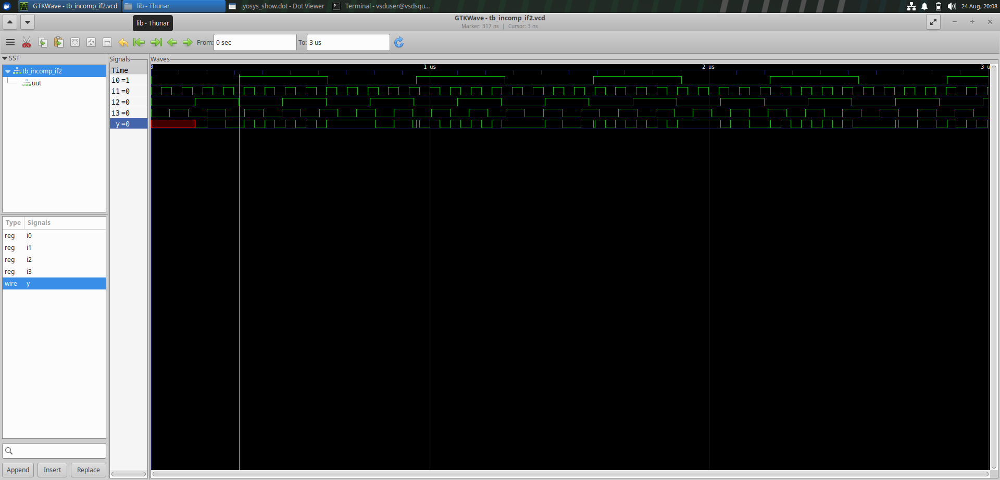

📊 Synthesized Netlist

"Incomplete IF-ELSE Netlist" 

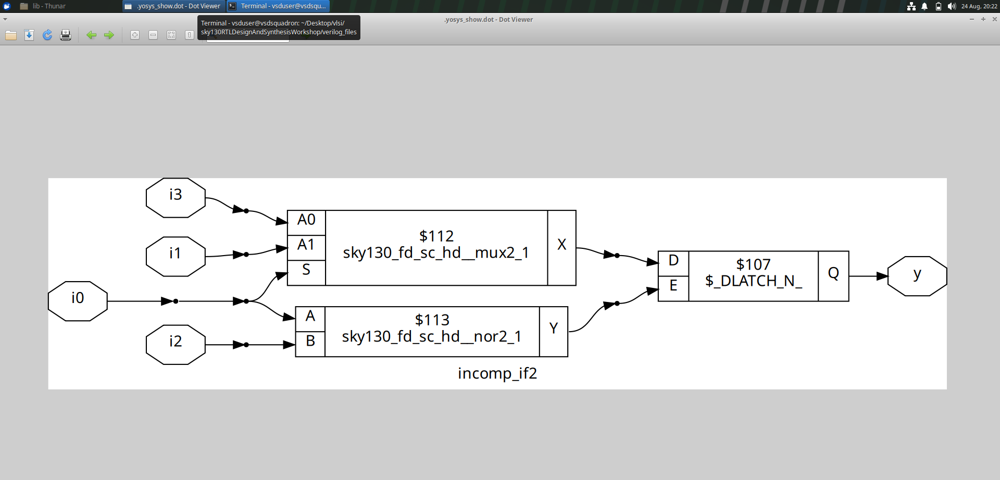

💡 Complete Version

always @(*)
begin
    if (i0)
        y = i1;
    else if (i2)
        y = i3;
    else
        y = 1'b0;
end

«🧠 Takeaway: Every possible execution path should assign an appropriate value to a combinational output.»

---

🔢 CASE Statements

A "case" statement compares a selector against multiple possible values.

Example:

always @(*)
begin
    case (sel)
        2'b00: y = i0;
        2'b01: y = i1;
        2'b10: y = i2;
        default: y = i3;
    endcase
end

"case" is commonly used for:

- 🔀 Multiplexers
- 🔢 Decoders
- 🎛️ Control logic
- 🔄 FSMs

---

🧪 Experiment 3 — Incomplete CASE

Consider a 2-bit selector with four possible combinations:

00
01
10
11

If only some values are described:

always @(*)
begin
    case (sel)
        2'b00: y = i0;
        2'b01: y = i1;
    endcase
end

then "10" and "11" do not receive assignments.

📈 Simulation Waveform

"Incomplete case Simulation"

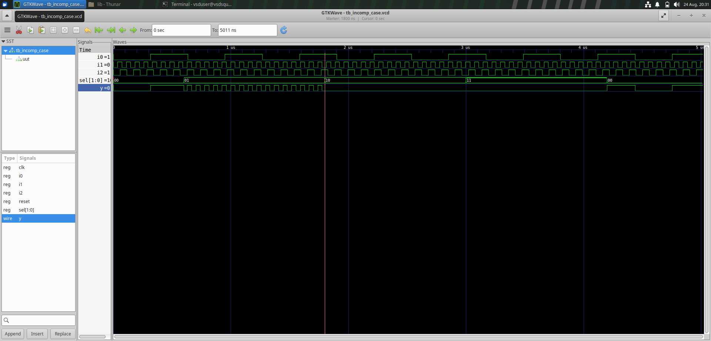

📊 Synthesized Netlist

"Incomplete CASE Netlist" 

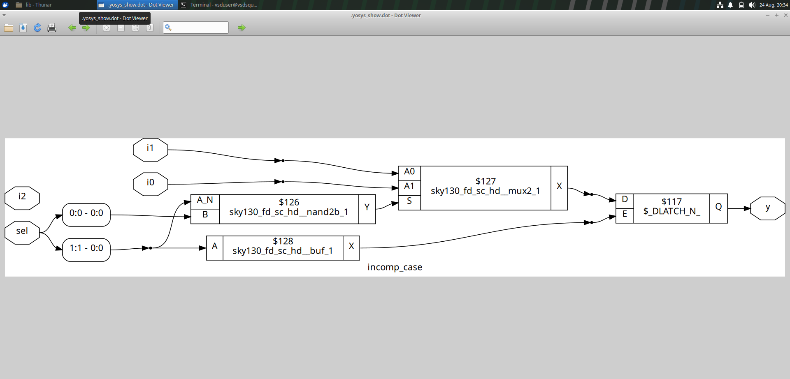

«⚠️ Observation: Missing case branches can result in incomplete combinational logic and unintended latch inference.»

---

🧪 Experiment 4 — Complete CASE

A "default" branch can provide coverage for all remaining selector values.

always @(*)
begin
    case (sel)
        2'b00: y = i0;
        2'b01: y = i1;
        default: y = i2;
    endcase
end

Now every selector value receives an output.

📈 Simulation Waveform

"Complete Case Simulation"

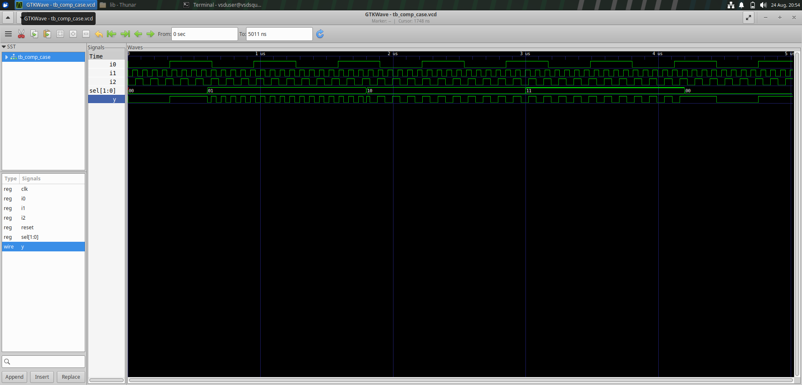

📊 Synthesized Netlist

"Complete case Netlist" 

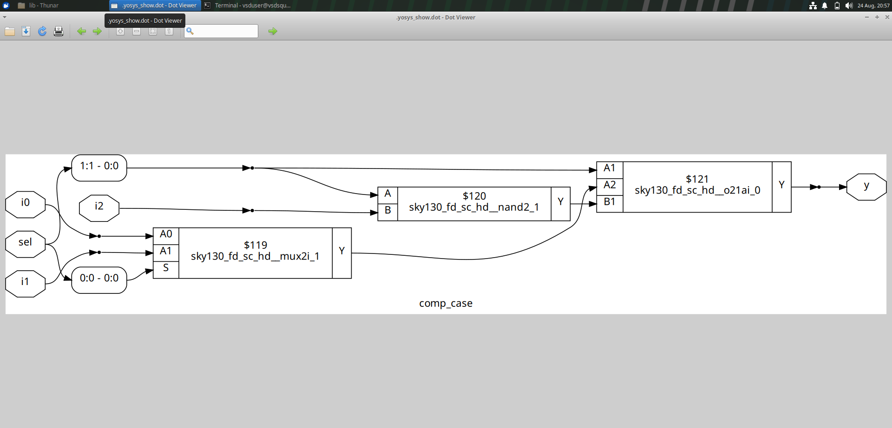

💡 Why "default" Matters

The "default" branch provides a defined output whenever none of the explicitly listed case items match.

---

🧪 Experiment 5 — Partial CASE Assignment

In combinational logic, each output must be considered separately.

Example:

always @(*)
begin
    case (sel)

        2'b00: begin
            y = i0;
            x = i2;
        end

        2'b01: begin
            y = i1;
        end

        default: begin
            y = i3;
            x = i4;
        end

    endcase
end

Here "y" receives an assignment in every branch.

However, "x" is not assigned when "sel = 2'b01".

Therefore, "x" can infer storage.

📊 Synthesized Netlist

"Partial CASE Assignment Netlist" 
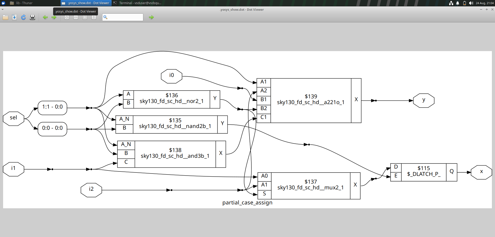

«🔍 Observation: Completeness needs to be checked for each output independently.»

---

🧪 Experiment 6 — CASEZ and Overlapping Conditions

"casez" allows wildcard matching.

For example:

casez (sel)
    2'b00: y = i0;
    2'b01: y = i1;
    2'b10: y = i2;
    2'b1?: y = i3;
endcase

The pattern:

2'b1?

can match both:

10
11

Therefore, "sel = 10" can match more than one case item.

🔍 Matching Table

"sel"| Matching Pattern
"00"| "00"
"01"| "01"
"10"| "10" and "1?" ⚠️
"11"| "1?"

📈 Simulation Waveform

"CASEZ Simulation"
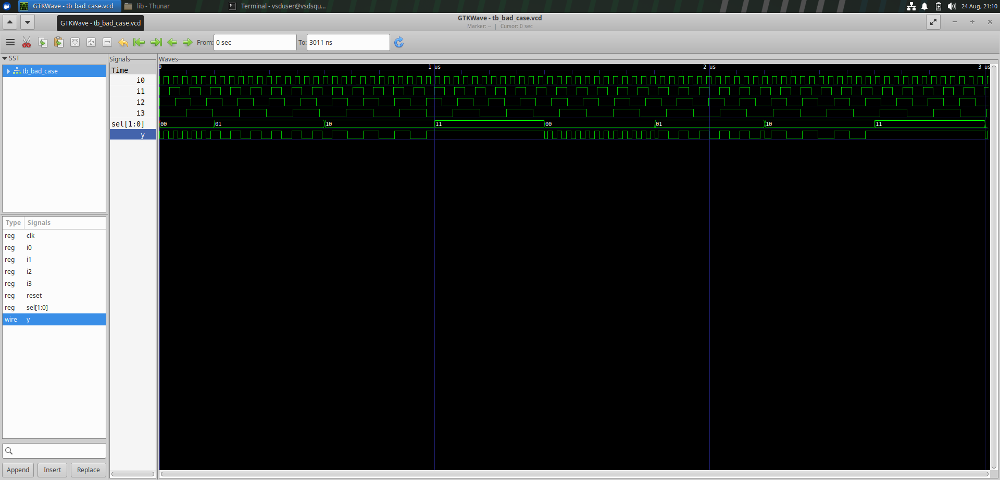

📊 Synthesized Netlist

"CASEZ Netlist" 
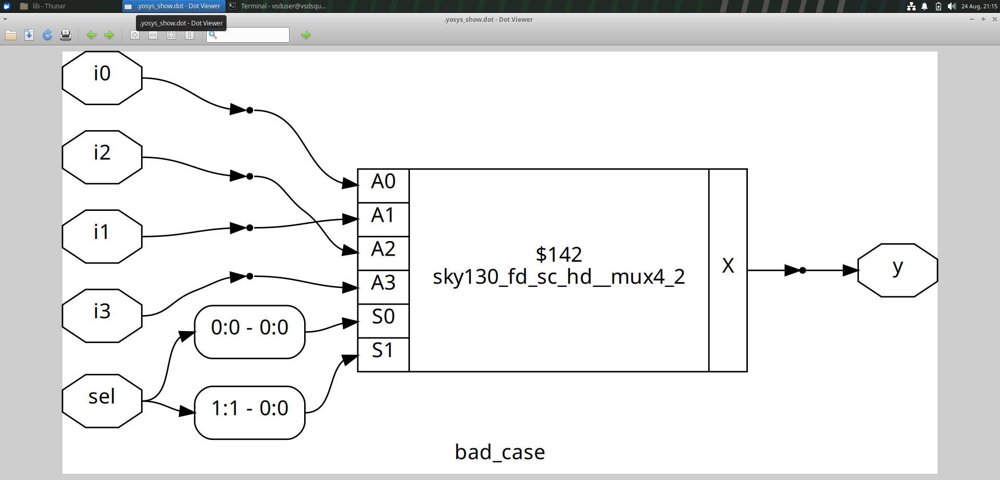

📈 GLS Simulation Waveform

"CASEZ GLS Simulation"

«⚠️ Observation: Wildcard patterns should be designed carefully because overlapping conditions can create unexpected selection behaviour.»

---

⚙️ Synthesis Optimization

Synthesis tools do not simply convert every RTL statement directly into gates.

They also perform logic optimization.

For example:

F = A + A'B

can be simplified to:

F = A + B

The redundant logic can be removed while preserving the intended functionality.

🔄 Optimization Flow

RTL
 ↓
Logic Analysis
 ↓
Boolean Simplification
 ↓
Optimization
 ↓
Technology Mapping
 ↓
Gate-Level Netlist

📌 Benefits

Benefit| Result
📉 Less logic| Reduced hardware
📦 Smaller area| Fewer cells
⚡ Better timing| Reduced logic complexity
🔋 Potential power reduction| Less unnecessary switching
🧩 Cleaner implementation| Optimized netlist

---

🔁 Looping Constructs in Verilog

Loops are useful when the same hardware operation needs to be repeated.

Two important forms are:

🔹 Procedural FOR Loop

Used inside an "always" block.

integer i;

always @(*)
begin
    for (i = 0; i < 4; i = i + 1)
    begin
        // Repeated operation
    end
end

🔹 Generate FOR Loop

Used to replicate hardware structures.

genvar i;

generate
    for (i = 0; i < WIDTH; i = i + 1)
    begin
        // Repeated hardware
    end
endgenerate

---

🧪 Experiment 7 — MUX Using FOR Loop

A multiplexer selects one input from several available inputs.

A loop can be used to describe repetitive selection logic without writing every condition separately.

Multiple Inputs
      ↓
 Select Signal
      ↓
     MUX
      ↓
 Single Output

📈 Simulation Waveform

"MUX Generate Simulation" 
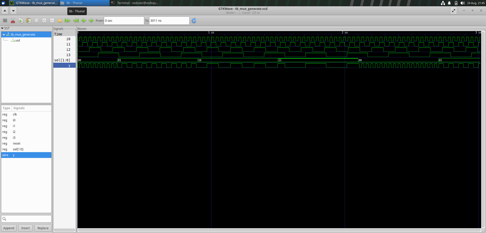

«✅ Observation: The waveform demonstrates the selection of the required input according to the select signal.»

---

↔️ Experiment 8 — DEMUX Using FOR Loop

A demultiplexer routes one input to one of several outputs.

For a 4-output DEMUX:

"sel"| Selected Output
"00"| Output 0
"01"| Output 1
"10"| Output 2
"11"| Output 3

A loop can be used to generate the repeated output-selection structure.

📈 Simulation Waveform

"DEMUX Generate Simulation" 
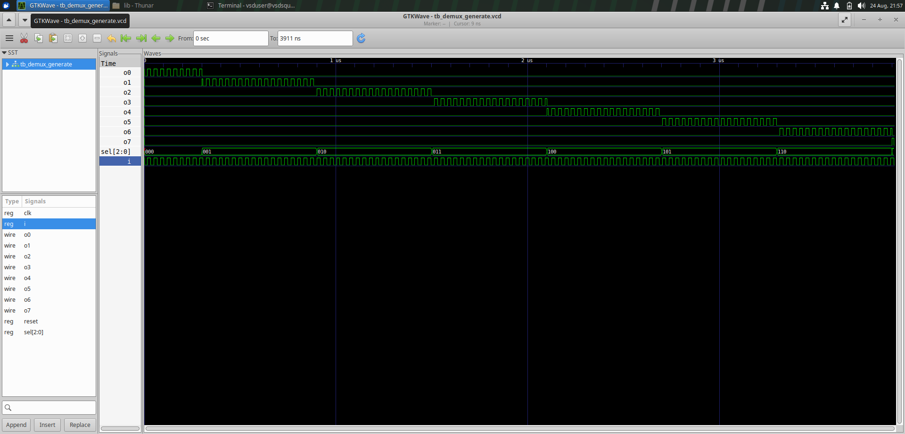

we will get the same output when we use case block for Demux
📈 Simulation Waveform

"DEMUX case Simulation" 
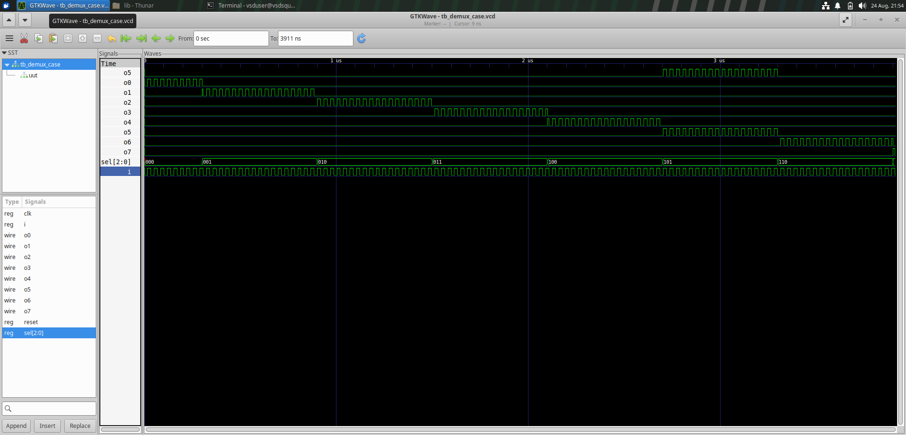

but using for loop will reduce no. of code lines.

«✅ Observation: The input is routed to the selected output while the remaining outputs stay inactive.»

---

🧮 Experiment 9 — Ripple Carry Adder

A Ripple Carry Adder (RCA) is constructed by connecting multiple Full Adders.

Each Full Adder receives:

- "A"
- "B"
- Carry-in

and produces:

- Sum
- Carry-out

🔗 Basic Structure

A0 ──┐
B0 ──┤
Cin ─┤
     ↓
  Full Adder
     │
     ├── Sum0
     │
     └── Carry1
            ↓
        Full Adder
            │
            ├── Sum1
            │
            └── Carry2
                   ↓
                 ...

A generate loop is useful for creating multiple Full Adder instances.

genvar i;

generate
    for (i = 0; i < WIDTH; i = i + 1)
    begin

        full_adder FA (
            .a(a[i]),
            .b(b[i]),
            .cin(carry[i]),
            .sum(sum[i]),
            .cout(carry[i+1])
        );

    end
endgenerate

📈 RCA Simulation Waveform

"RCA Simulation"
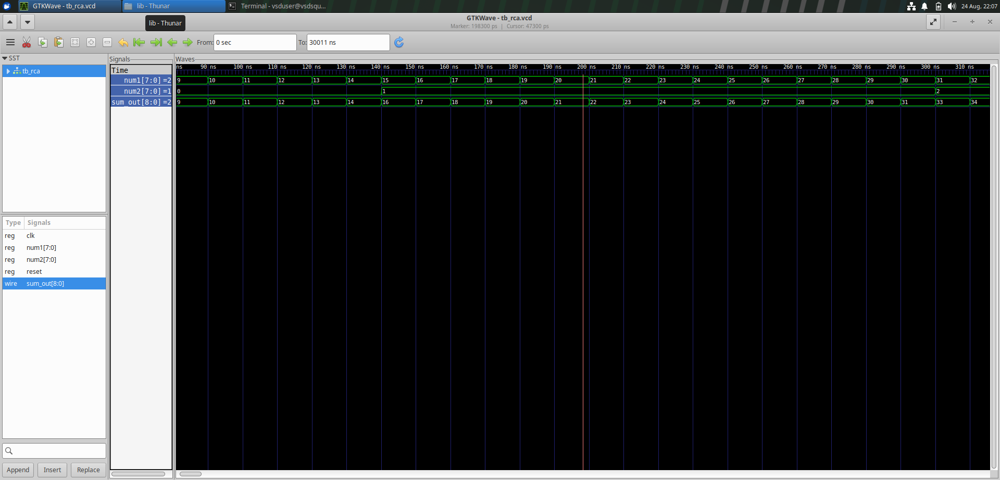

«✅ Observation: The waveform verifies the addition operation and carry propagation through the Full Adder stages.»

---

⚖️ Procedural FOR vs Generate FOR

Feature| Procedural "for"| Generate "for"
📍 Location| Inside "always"| Outside procedural blocks
🎯 Purpose| Repeats operations| Replicates hardware
🧩 Nature| Behavioural| Structural
🔄 Execution| Procedural| Elaboration
🔀 Useful for MUX| ✅| ✅
↔️ Useful for DEMUX| ✅| ✅
🧮 Useful for RCA| ➖| ✅
🏗️ Repeated module instances| ❌| ✅

💡 Simple Difference

Procedural FOR:

«"Repeat this operation."»

Generate FOR:

«"Create multiple copies of this hardware."»

---

🔍 CASE vs IF-ELSE

Feature| IF-ELSE| CASE
Main purpose| Priority decisions| Multi-way selection
Evaluation| Sequential| Selector based
Priority| Naturally present| Depends on coding
Common applications| Priority logic| MUX / Decoder / FSM
Main concern| Complete assignments| Coverage & overlap

---

🚨 Common RTL Coding Issues

⚠️ Coding Issue| Possible Result
Missing "else"| Latch inference
Incomplete "case"| Latch inference
Partial output assignment| Storage inference
Overlapping "casez"| Unexpected selection
Poor coding style| Unwanted synthesized hardware

⭐ General Rule

«For combinational RTL, every output should receive a defined value for every possible execution path.»

---

🛠️ Tools Used

🧰 Tool| 🎯 Purpose
Icarus Verilog| Verilog compilation and simulation
GTKWave| Waveform visualization
Yosys| RTL synthesis and optimization
SKY130 PDK| Technology mapping and standard-cell implementation

---

📊 Experiments Completed

Experiment| Concept| Status
🧪 1| Incomplete IF| ✅
🧪 2| Incomplete IF-ELSE| ✅
🧪 3| Incomplete CASE| ✅
🧪 4| Complete CASE| ✅
🧪 5| Partial CASE Assignment| ✅
🧪 6| CASEZ / Overlapping Conditions| ✅
🧪 7| MUX using FOR| ✅
🧪 8| DEMUX using FOR| ✅
🧪 9| Ripple Carry Adder| ✅

---

🧠 Key Takeaways

🔹 1. Complete RTL Matters

Every combinational execution path should assign the required outputs.

🔹 2. Incomplete Assignments Can Infer Latches

If an output is not assigned in every path, synthesis may infer storage.

🔹 3. CASEZ Needs Care

Wildcard matching can cause overlapping conditions.

🔹 4. Synthesis Optimizes Logic

The synthesized circuit may look different from the RTL while preserving its functionality.

🔹 5. Loops Improve Scalability

Procedural and generate loops reduce repetitive RTL and make designs easier to scale.

---

🎓 Learning Outcomes

After completing Day 5, I gained a better understanding of:

- ✅ "if-else" conditional logic
- ✅ Priority-based RTL
- ✅ "case" statements
- ✅ Complete and incomplete combinational logic
- ✅ Latch inference
- ✅ Partial assignment
- ✅ "casez" wildcard matching
- ✅ Overlapping case conditions
- ✅ Synthesis optimization
- ✅ Procedural "for" loops
- ✅ Generate "for" loops
- ✅ MUX design
- ✅ DEMUX design
- ✅ Ripple Carry Adder
- ✅ Scalable RTL coding
- ✅ Synthesis-friendly design practices

---

🌟 My Day 5 Takeaway

Day 5 helped me understand that the way RTL is written directly influences the hardware inferred during synthesis.

The incomplete "if" and "case" experiments showed how missing assignments can result in unintended storage.

The "casez" experiment demonstrated why wildcard conditions must be designed carefully.

The synthesis section showed how optimization can simplify RTL logic while preserving functionality.

Finally, the MUX, DEMUX and RCA experiments demonstrated how loops can make RTL descriptions more structured, reusable and scalable.

       💻 RTL CODE
            ↓
    🔀 Conditional Logic
            ↓
      🔁 Loop Constructs
            ↓
       ⚙️ Synthesis
            ↓
     📄 Netlist
            ↓
       🧪 Simulation
            ↓
      📊 Verification

---

🏁 Conclusion

Day 5 strengthened my understanding of conditional statements, case constructs, latch inference, wildcard matching, synthesis optimization and looping techniques in Verilog.

The experiments provided practical insight into how small RTL coding decisions can influence the hardware generated during synthesis.

By working with MUX, DEMUX and Ripple Carry Adder designs, I also understood how procedural and generate loops can be used to create structured and scalable RTL.

«💡 Key takeaway: Good RTL should be complete, unambiguous, scalable and written with the synthesized hardware in mind.»

---

🚀 Day 5 Status

Milestone| Status
📖 Conditional RTL concepts| ✅ Completed
🔀 IF-ELSE experiments| ✅ Completed
🔢 CASE experiments| ✅ Completed
⚠️ Latch inference| ✅ Completed
🔍 CASEZ analysis| ✅ Completed
⚙️ Synthesis optimization| ✅ Completed
🔁 FOR loops| ✅ Completed
🔀 MUX| ✅ Completed
↔️ DEMUX| ✅ Completed
🧮 RCA| ✅ Completed
📸 Images uploaded| ✅ Completed
📝 README| ⏳ Updating

---

✨ Day 5 Complete!

«Conditional RTL → Optimization → Loops → Scalable Hardware 🔥💻»

---
