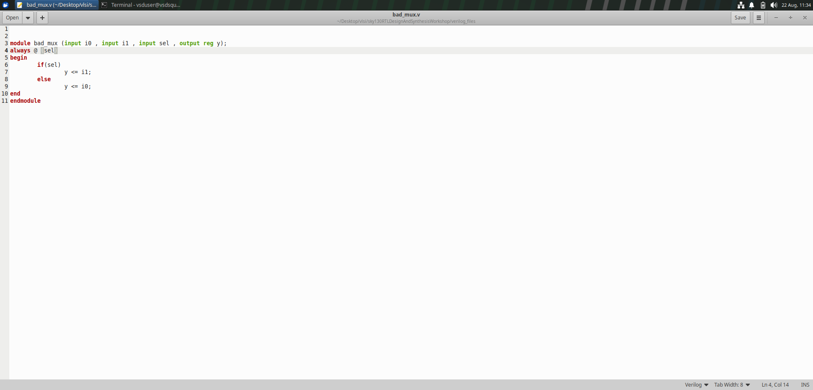
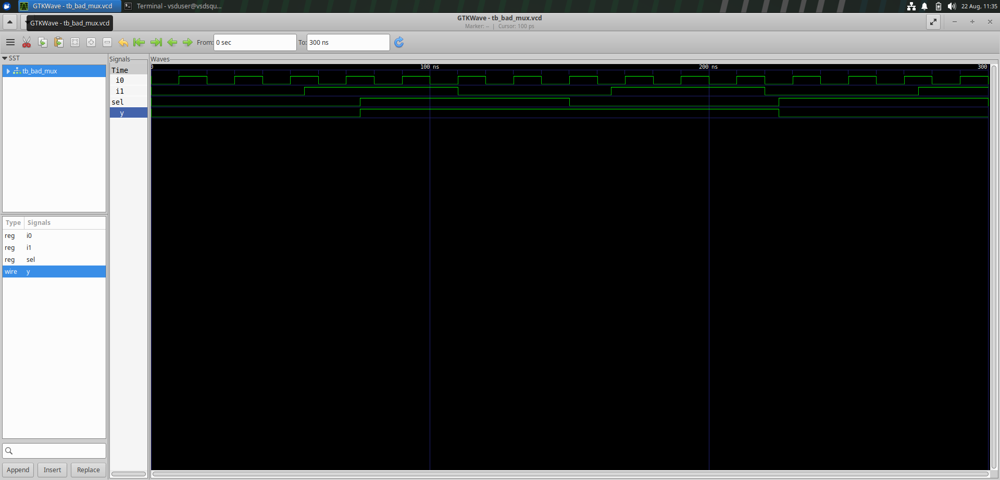
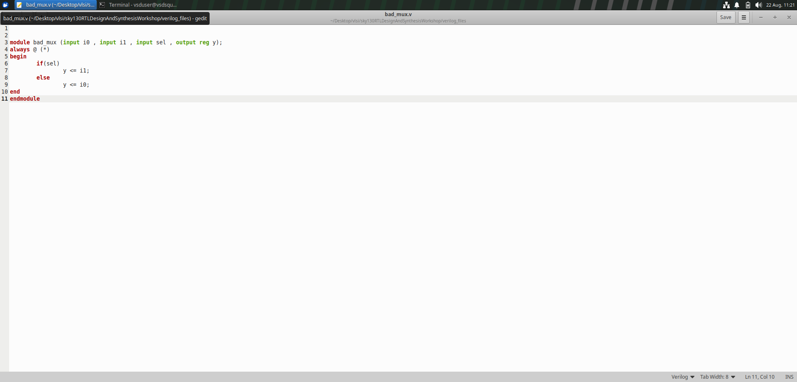
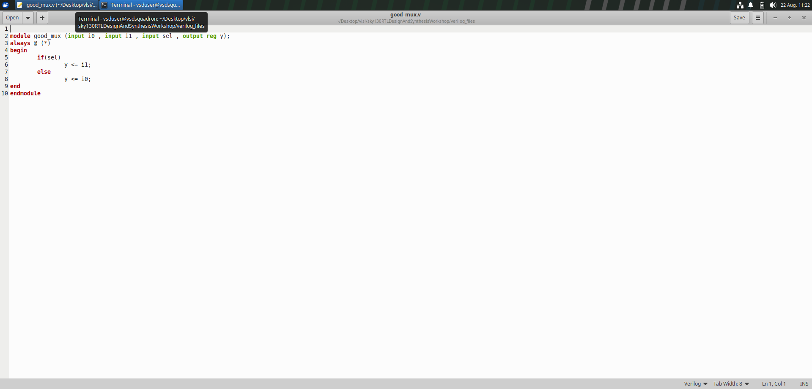
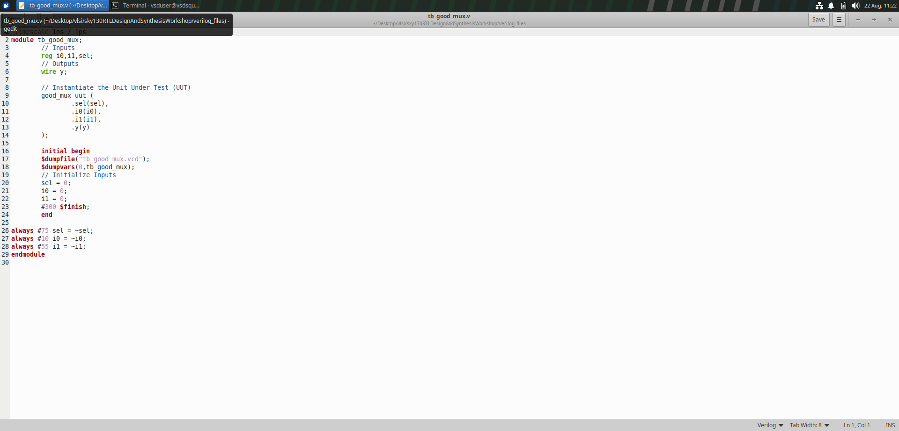
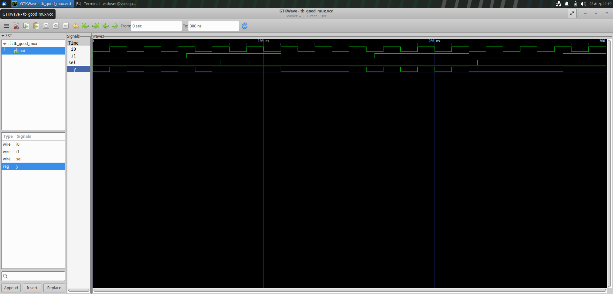
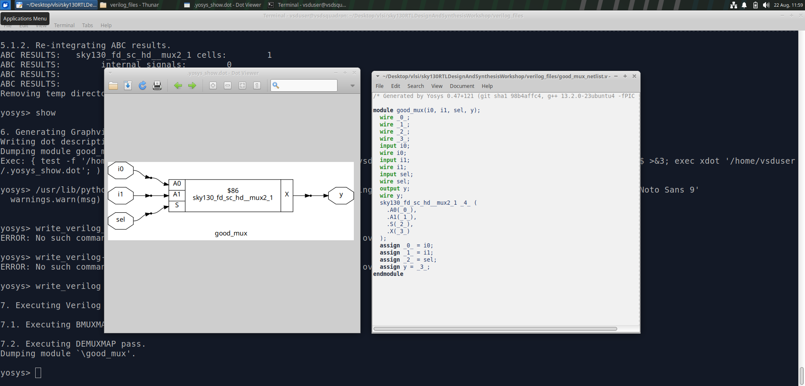
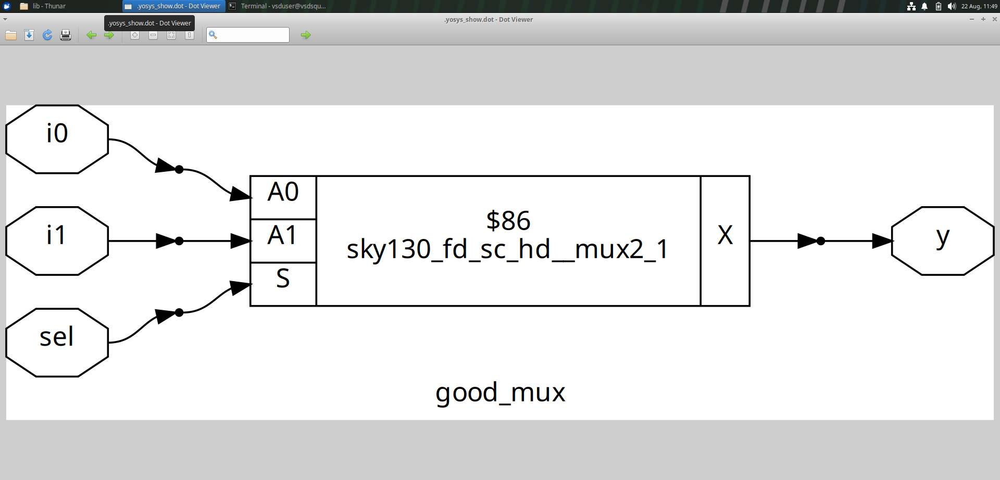
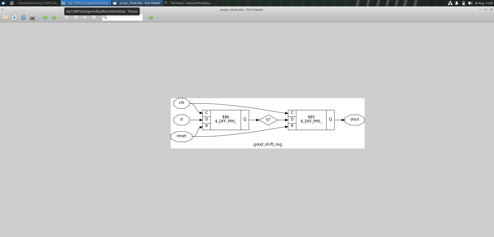
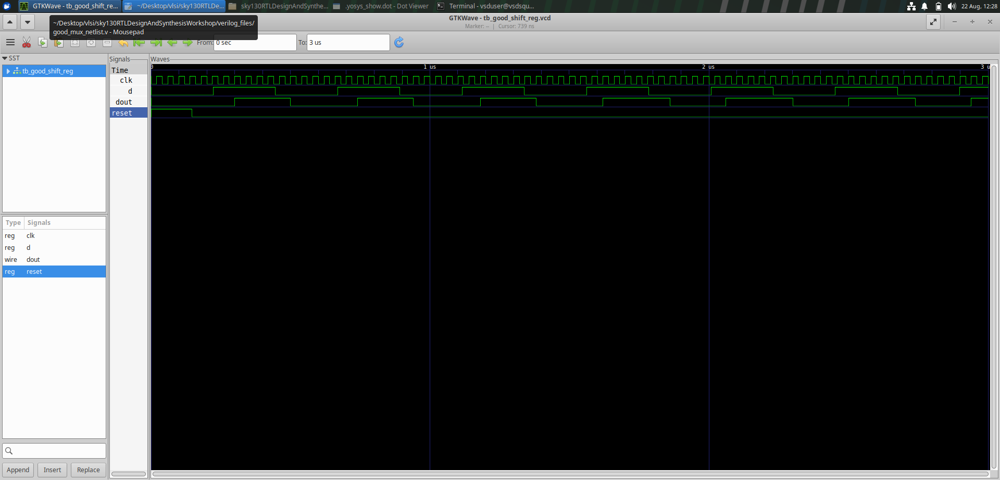

# 🧪 Additional RTL Design Labs

<p align="center">
  <b>Verilog RTL Design • Simulation • Debugging • Synthesis</b><br>
  Hands-on Digital Design Exercises
</p>

---

## 📌 Overview

This section contains additional digital design exercises completed during the RTL and VLSI design labs.

The exercises focus on understanding basic digital circuits, writing Verilog RTL, identifying design issues, verifying functionality through simulation, and observing the synthesized gate-level implementation.

### Exercises Covered

- 🔴 BADMUX RTL debugging and correction
- 🟢 MUX RTL, testbench and synthesis
- 🔄 Shift Register synthesis and simulation

---

# 1️⃣ BAD MUX – RTL Debugging & Correction

## 🎯 Objective

The objective of this exercise was to analyze a BADMUX RTL implementation, identify the design issue, correct the RTL and verify the corrected design through simulation.

A **Multiplexer (MUX)** is a combinational circuit that selects one input from multiple inputs based on a select signal.

---

## 📝 Initial BAD MUX RTL

The initial MUX implementation was examined to understand the RTL description and identify the source of the incorrect behavior.



---

## 📊 Initial MUX Simulation

The initial RTL was simulated and the output waveform was observed using GTKWave.



### 🔎 Observation

The simulation waveform was analyzed to identify the mismatch between the expected and observed MUX behavior.

---

## 🛠️ Corrected BAD MUX RTL

After identifying the issue, the RTL implementation was modified.



---

## ✅ Corrected MUX Simulation

The corrected RTL was simulated again to verify the modification.


### 🔎 Observation

The corrected simulation demonstrates the expected functional behavior of the MUX for the applied inputs and select signal.

---

# 2️⃣ Good MUX – RTL to Netlist

## 🎯 Objective

This exercise demonstrates the implementation of a correctly functioning MUX and its progression from RTL design to simulation and synthesized gate-level representation.

---

## 📝 MUX RTL

The Verilog RTL implementation of the MUX is shown below.



The RTL describes the combinational relationship between the inputs, select signal and output.

---

## 🧪 MUX Testbench

A Verilog testbench was used to apply different input combinations and verify the MUX functionality.



---

## 📈 MUX Simulation

The MUX was simulated and the resulting waveform was analyzed using GTKWave.



### 🔎 Observation

The waveform demonstrates the expected response of the MUX for the applied testbench inputs.

---

## 🔧 MUX Synthesis

After functional verification, the MUX RTL was synthesized to obtain its gate-level representation.

---

## 🧩 Synthesized MUX Netlist

The synthesized MUX is represented as a gate-level netlist.



---

## 🔍 MUX Netlist Structure

The synthesized design was also examined through its graphical netlist representation.



### 🔎 Observation

The netlist provides a structural view of the synthesized MUX and shows the logic cells and their interconnections.

---

# 3️⃣ Good Shift Register

## 🎯 Objective

This exercise focuses on the synthesized implementation and simulation of a shift-register design.

A **shift register** is a sequential digital circuit that stores and shifts binary data according to a clock signal.

---

## 🔧 Shift Register Netlist

The synthesized shift-register design was examined through its gate-level netlist.



### 🔎 Observation

The netlist provides a structural representation of the synthesized shift-register implementation.

---

## 📊 Shift Register Waveform

The shift register was simulated and its behavior was observed using GTKWave.



### 🔎 Observation

The waveform demonstrates the shifting of data with respect to the clock and input signals.

---

# 🔄 Overall Design Flow

The exercises covered in this section can be summarized as:

```text
RTL Design
     ↓
Functional Simulation
     ↓
Waveform Analysis
     ↓
RTL Debugging
     ↓
RTL Correction
     ↓
Re-Simulation
     ↓
Functional Verification
     ↓
Logic Synthesis
     ↓
Gate-Level Netlist
     ↓
Netlist Analysis

```
----

🧠 Key Concepts Learned

Multiplexer:
Selects one input from multiple inputs using a select signal

Shift Register:
Stores and shifts binary data using clocked logic

RTL Design:
Describes hardware functionality using Verilog

RTL Debugging:
Identifies and corrects functional design issues

Testbench:
Provides stimulus for design verification

Simulation:
Verifies circuit functionality

GTKWave:
Used to visualize and analyze waveforms

Synthesis:
Converts RTL into a gate-level implementation

Netlist:
Represents the structural implementation of the synthesized design

Gate-Level Analysis:
Helps understand the hardware generated after synthesis
----
🛠️ Tools Used

Verilog HDL-RTL design
Icarus Verilog-Simulation
GTKWave-Waveform analysis
Yosys-Logic synthesis
SKY130-Standard-cell technology
----
📈 Work Summary
``` text
┌──────────────────────────────┐
│       MUX Debugging          │
│                              │
│ Initial RTL → Simulation     │
│        ↓                     │
│ Identify Issue               │
│        ↓                     │
│ Correct RTL → Simulation     │
└──────────────┬───────────────┘
               │
               ▼
┌──────────────────────────────┐
│          Good MUX            │
│                              │
│ RTL → Testbench → Simulation │
│        ↓                     │
│      Synthesis               │
│        ↓                     │
│     Gate Netlist             │
└──────────────┬───────────────┘
               │
               ▼
┌──────────────────────────────┐
│      Good Shift Register     │
│                              │
│     Synthesis → Netlist      │
│             ↓                │
│       Waveform Analysis      │
└──────────────────────────────┘

```
----
🎯 Learning Outcomes
Through these exercises, I gained practical experience in:
Writing Verilog RTL.
Understanding combinational and sequential circuits.
Debugging RTL implementations.
Creating and using testbenches.
Running functional simulations.
Analyzing waveforms using GTKWave.
Understanding logic synthesis.
Examining synthesized gate-level netlists.
Relating RTL functionality to synthesized hardware.
----
🏁 Conclusion
These exercises provided hands-on experience with fundamental digital design concepts, RTL verification and synthesis.
The MUX debugging exercise demonstrated the importance of identifying and correcting RTL issues, while the Good MUX and Shift Register exercises provided practical exposure to simulation, synthesis and gate-level netlist analysis.
