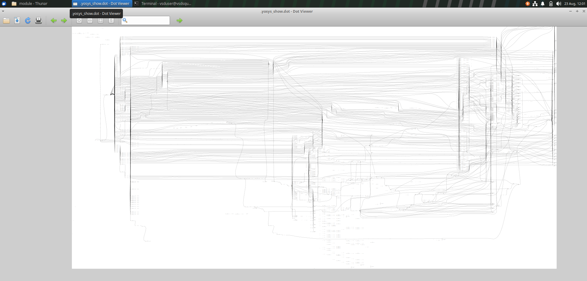
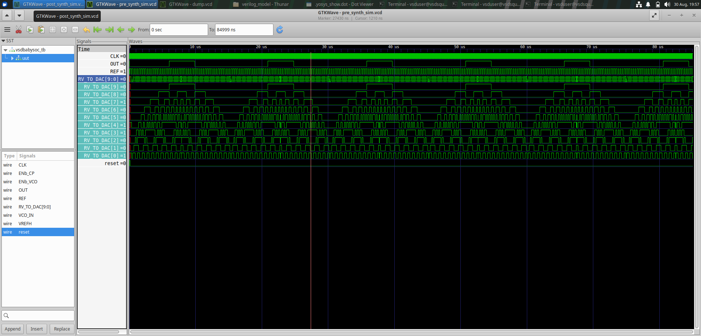
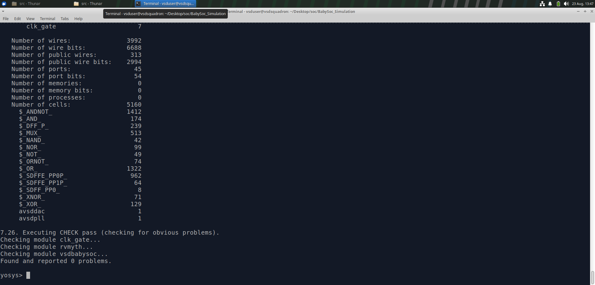
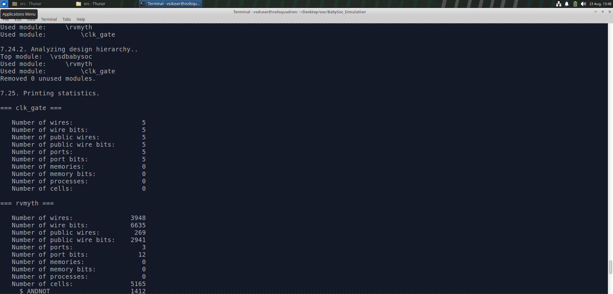
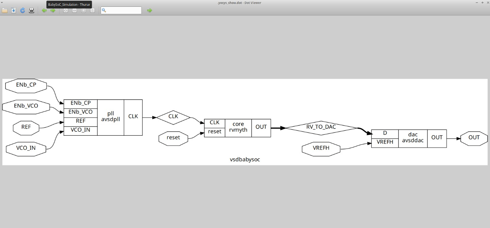
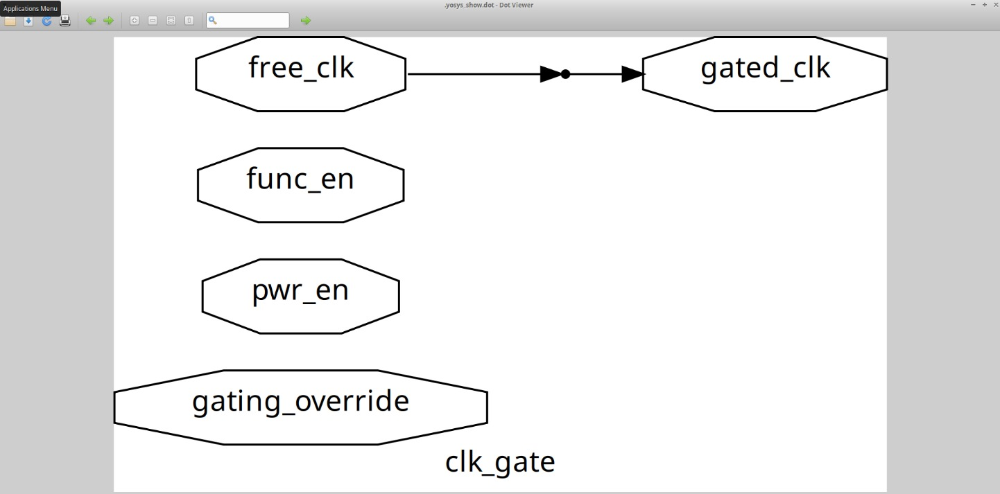
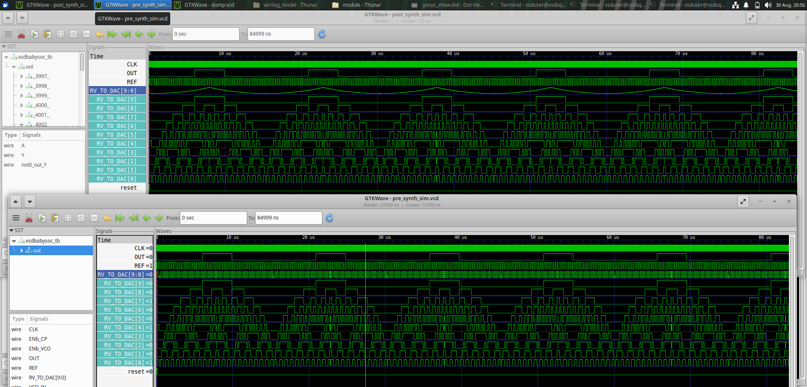

# 🧩 BabySoC – RTL to Gate-Level Simulation

<p align="center">
  <b>VLSI Design & ASIC Implementation Lab</b><br>
  RTL Design → Simulation → Synthesis → Netlist → Gate-Level Verification
</p>

---

## 📌 Overview

BabySoC is a compact System-on-Chip design used to understand the transformation of a hardware design from RTL description to a synthesized gate-level implementation.

This lab explores the important stages of the digital ASIC design flow, including:

- RTL design understanding
- Pre-synthesis simulation
- Logic synthesis
- Synthesis statistics
- Netlist generation
- Clock-gating logic
- Post-synthesis gate-level simulation
- RTL and gate-level waveform comparison

The main objective is to understand how the design evolves through the synthesis flow while verifying that its intended functionality is preserved.

---

# 🏗️ BabySoC Architecture

BabySoC integrates multiple functional blocks to form a compact System-on-Chip.

The major components involved are:

```text
                    ┌───────────────────┐
                    │       PLL         │
                    │ Clock Generation  │
                    └─────────┬─────────┘
                              │
                              ▼
                    ┌───────────────────┐
                    │      RVMyth       │
                    │ Digital Processor │
                    └─────────┬─────────┘
                              │
                         Digital Data
                              │
                              ▼
                    ┌───────────────────┐
                    │       DAC         │
                    │ Digital → Analog  │
                    └─────────┬─────────┘
                              │
                              ▼
                            OUT
```

The RVMyth block provides the main digital processing functionality, while the PLL and DAC support clock generation and digital-to-analog conversion within the BabySoC.
---

# 🔍 RVMyth – RISC-V Based Processor

RVMyth is the digital processing core used in the BabySoC design.

It is based on the RISC-V instruction set architecture and forms the main processing element of the SoC. The processor interacts with the surrounding blocks to provide the digital data required by the system.

### RVMyth Reference



---

# 🔄 BabySoC Design Flow

The BabySoC lab follows a sequence of design, verification and synthesis steps:

```text
RTL Design
     ↓
Pre-Synthesis Simulation
     ↓
Logic Synthesis
     ↓
Synthesis Statistics
     ↓
Synthesized Netlist
     ↓
Post-Synthesis / Gate-Level Simulation
     ↓
RTL vs Gate-Level Comparison


```
This flow helps in understanding the transformation from an RTL description into a synthesized hardware implementation and provides a method for verifying the resulting design.

# 1️⃣ Pre-Synthesis Simulation

Before synthesis, the RTL design is simulated to verify its intended functional behavior.

Simulation allows us to observe the response of the design for the given testbench and provides a reference waveform that can later be compared with the gate-level simulation.

### 📊 Pre-Synthesis Waveform



### 🔎 Observation

The waveform shows the behavior of the BabySoC design at the RTL level before synthesis.

This waveform serves as the reference for checking whether the synthesized implementation maintains the expected functionality.

---

# 2️⃣ Logic Synthesis

After successful RTL simulation, the design is taken through the logic synthesis stage.

Synthesis converts the RTL description into a gate-level representation using cells from the target standard-cell library.

The synthesis process also performs logic optimization and technology mapping to obtain a hardware-oriented implementation of the design.

---

## 📊 Synthesis Statistics

The synthesis reports provide information about the resulting hardware structure and give an indication of the complexity of the synthesized design.

### Statistics – 1



### Statistics – 2


---

# 3️⃣ Synthesized Netlist

After logic synthesis, the RTL design is transformed into a gate-level netlist.

The synthesized netlist represents the structural implementation of the BabySoC using interconnected logic cells from the target technology library.

### 🧩 BabySoC Synthesized Netlist



### 🔎 Observation

The synthesized netlist provides a structural view of the BabySoC after the synthesis process.

It shows how the original RTL functionality has been mapped into a network of hardware cells and their connections.

---

# 4️⃣ Clock-Gating Netlist

Clock gating is used in digital designs to control unnecessary clock activity and can help reduce dynamic power consumption.

The synthesized clock-gating netlist provides a view of the clock-control logic present in the BabySoC implementation.

### ⏱️ Clock-Gating Netlist



### 🔎 Observation

The netlist shows the clock-gating structure introduced in the synthesized implementation and provides a structural view of the clock-control logic.

---

# 5️⃣ Post-Synthesis / Gate-Level Simulation

After synthesis, the generated gate-level implementation is simulated to verify its behavior.

This process is known as **Gate-Level Simulation (GLS)**.

Unlike pre-synthesis simulation, which works with the RTL description, gate-level simulation uses the synthesized netlist to verify the implemented logic.
---

# 5️⃣ Post-Synthesis / Gate-Level Simulation

After synthesis, the generated gate-level implementation is simulated to verify its behavior.

This stage is known as **Gate-Level Simulation (GLS)**. It helps verify the functionality of the synthesized design using the generated gate-level representation.

### 📊 Post-Synthesis Simulation


### 🔎 Observation

The post-synthesis waveform shows the behavior of the BabySoC after synthesis.

The waveform can be compared with the pre-synthesis simulation to check whether the expected functional behavior is maintained.

---

# 6️⃣ RTL vs Post-Synthesis Comparison ⭐

Comparing the pre-synthesis and post-synthesis simulations is an important verification step.

The RTL waveform represents the expected behavior of the original design, while the post-synthesis waveform represents the behavior of the synthesized gate-level implementation.

### 📈 Waveform Comparison



### 🔎 Observation

The pre-synthesis and post-synthesis waveforms show consistent functional behavior for the applied testbench.

This indicates that the synthesis process has transformed the RTL into a gate-level implementation while preserving the intended functionality of the design.

---

# 🧠 Key Concepts Learned

| Concept | Understanding |
|---|---|
| RTL Design | Describes the intended hardware behavior |
| Pre-Synthesis Simulation | Verifies the RTL functionality |
| Logic Synthesis | Converts RTL into a gate-level representation |
| Technology Mapping | Maps logic to cells from the target library |
| Netlist | Represents the structural hardware implementation |
| Clock Gating | Controls unnecessary clock activity |
| Gate-Level Simulation | Verifies the synthesized implementation |
| Waveform Comparison | Checks functional consistency before and after synthesis |

---

# 🛠️ Tools & Technologies

- **Verilog HDL** – Hardware description
- **Icarus Verilog** – Simulation
- **GTKWave** – Waveform visualization
- **Yosys** – Logic synthesis
- **SKY130** – Target standard-cell technology

---

# 📈 Implementation Flow Summary

The complete BabySoC flow explored in this lab can be summarized as:

```text
┌──────────────────────────────┐
│          RTL Design          │
└──────────────┬───────────────┘
               │
               ▼
┌──────────────────────────────┐
│   Pre-Synthesis Simulation   │
└──────────────┬───────────────┘
               │
               ▼
┌──────────────────────────────┐
│       Logic Synthesis        │
└──────────────┬───────────────┘
               │
               ▼
┌──────────────────────────────┐
│    Synthesis Statistics      │
└──────────────┬───────────────┘
               │
               ▼
┌──────────────────────────────┐
│     Gate-Level Netlist       │
└──────────────┬───────────────┘
               │
               ▼
┌──────────────────────────────┐
│  Post-Synthesis Simulation   │
└──────────────┬───────────────┘
               │
               ▼
┌──────────────────────────────┐
│  RTL vs GLS Verification     │
└──────────────────────────────┘

```

  ---

# 🎯 Learning Outcomes

Through this BabySoC lab, I gained practical understanding of:

- The basic architecture of a System-on-Chip.
- The role of the RVMyth processor within the BabySoC.
- RTL-level functional simulation.
- Logic synthesis and technology mapping.
- Interpretation of synthesis statistics.
- Understanding synthesized gate-level netlists.
- The purpose of clock-gating logic.
- Gate-Level Simulation (GLS).
- Comparing RTL and post-synthesis waveforms for functional verification.

---

# 💡 Key Takeaways

> **RTL describes the intended functionality of the hardware, while synthesis transforms that functionality into a gate-level implementation.**

The BabySoC lab demonstrates the transition:

**RTL → Simulation → Synthesis → Netlist → Gate-Level Verification**

The comparison between pre-synthesis and post-synthesis simulations highlights the importance of verification at different stages of the digital design flow.

---

# 🏁 Conclusion

The BabySoC lab provided practical exposure to the RTL-to-gate-level design flow.

Starting from RTL simulation, the design was synthesized into a gate-level representation, followed by examination of synthesis statistics and netlists. The synthesized implementation was then verified through Gate-Level Simulation.

This exercise helped in understanding how a digital design moves from **RTL description to synthesized hardware** while maintaining the intended functionality through the design flow.

---

<p align="center">
  <b>✨ BabySoC Lab — From RTL to Gate-Level Verification ✨</b>
</p>

